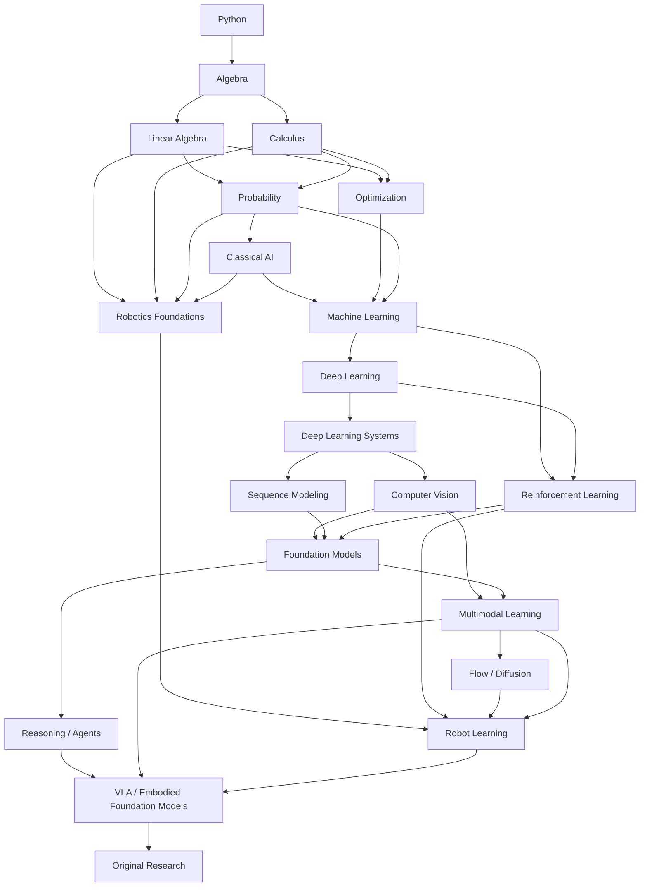

# AI Research Curriculum

> An OSSU-style curriculum for self-taught AI research, from mathematical foundations to Foundation Models, Agents, and Robotics AI.

**Version:** 2026.10  
**Workload:** 10 hours/week  
**Core duration:** ~4.5–5 years  
**Primary language:** Python  
**Systems language:** C++ / CUDA / Triton when needed  
**Goal:** Research Scientist-level foundations with a path toward Robotics AI / Physical Intelligence

---

## Contents

- [Curriculum overview](#curriculum-overview)
- [How to study](#how-to-study)
- [Prerequisite map](#prerequisite-map)
- [0. Preparation](#0-preparation)
- [1. Mathematical foundations](#1-mathematical-foundations)
- [2. Classical artificial intelligence](#2-classical-artificial-intelligence)
- [3. Machine learning](#3-machine-learning)
- [4. Deep learning from first principles](#4-deep-learning-from-first-principles)
- [5. Vision and sequence modeling](#5-vision-and-sequence-modeling)
- [6. Reinforcement learning](#6-reinforcement-learning)
- [7. Foundation models and LLMs](#7-foundation-models-and-llms)
- [8. Reasoning, agents, and multimodal learning](#8-reasoning-agents-and-multimodal-learning)
- [9. Flow matching and diffusion](#9-flow-matching-and-diffusion)
- [10. Robotics foundations](#10-robotics-foundations)
- [11. Robot learning](#11-robot-learning)
- [12. Vision-Language-Action models](#12-vision-language-action-models)
- [13. Research phase](#13-research-phase)
- [Electives](#electives)
- [Anchor papers](#anchor-papers)
- [Project standard](#project-standard)
- [Compute](#compute)
- [Graduation criteria](#graduation-criteria)
- [Resource maintenance](#resource-maintenance)

---

# Curriculum overview

The curriculum is sequential. Finish the prerequisite courses before moving to the next stage; companion books may be read alongside a primary course.

| Order | Code | Subject | Primary resource | Duration |
|---:|---|---|---|---:|
| 1 | PY-001 | Python for Scientific Computing | Python Tutorial + NumPy Learn | 3 weeks |
| 2 | MATH-000 | Algebra & Functions Refresher | Khan Academy | 6 weeks |
| 3 | MATH-101 | Linear Algebra | MIT 18.06SC | 10 weeks |
| 4 | MATH-102 | Calculus for ML | MIT 18.01SC + selected 18.02 | 10 weeks |
| 5 | MATH-103 | Probability | Harvard Stat 110 | 10 weeks |
| 6 | MATH-104 | Optimization for ML | Mathematics for Machine Learning + CS229 notes | 4 weeks |
| 7 | AI-101 | Classical Artificial Intelligence | UC Berkeley CS188 | 10 weeks |
| 8 | ML-201 | Machine Learning | Stanford CS229 | 12 weeks |
| 9 | DL-301 | Deep Learning Foundations | Understanding Deep Learning | 8 weeks |
| 10 | SYS-302 | Deep Learning Systems | CMU 10-414/714 | 14 weeks |
| 11 | CV-401 | Computer Vision | Stanford CS231n | 10 weeks |
| 12 | NLP-402 | Sequence Modeling / NLP | Stanford CS224N | 8 weeks |
| 13 | RL-501 | Reinforcement Learning | Stanford CS234 | 10 weeks |
| 14 | FM-601 | Language Modeling from Scratch | Stanford CS336 | 16 weeks |
| 15 | FM-602 | Modern Architecture Lab | Papers + technical reports | 8 weeks |
| 16 | AG-701 | Reasoning & Agents | Stanford CS329A | 8 weeks |
| 17 | MM-702 | Multimodal Machine Learning | CMU 11-777 | 10 weeks |
| 18 | GEN-801 | Flow Matching & Diffusion | MIT 6.S184 | 6 weeks |
| 19 | ROB-901 | Differential Equations & Mechanics | MIT 18.03 + mechanics material | 6 weeks |
| 20 | ROB-902 | Modern Robotics | Northwestern Modern Robotics | 10 weeks |
| 21 | ROB-903 | Underactuated Robotics | MIT Underactuated Robotics | 12 weeks |
| 22 | ROB-904 | Robotic Manipulation | MIT 6.4210/6.4212 | 12 weeks |
| 23 | RRL-1001 | Robot Learning | Stanford CS224R | 12 weeks |
| 24 | VLA-1101 | Embodied Foundation Models | Open X-Embodiment / OpenVLA / openpi | 18 weeks |
| 25 | RES-1201 | Original Research | Paper-driven | Ongoing |

At 10 hours/week, the core path before open-ended research is approximately 245 weeks.

---

# How to study

Use one core subject at a time. A course is complete when you can explain the main idea, derive the central mathematics, implement the important mechanism, identify its failure modes, and reproduce at least one non-trivial result.

| Day | Focus | Suggested session |
|---|---|---|
| Monday | Theory + mathematics | 60m concepts, 45m derivation, 15m recall |
| Tuesday | Implementation | 20m recall, 90m coding, 10m notes |
| Wednesday | Implementation | 90m coding, 30m tests/debugging |
| Thursday | Experiments | 30m prediction, 60m experiment, 30m analysis |
| Friday | Paper / reproduction | 45m reading, 60m reproduction, 15m notes |

For serious experiments, write the expected outcome before running the experiment.

### Resource labels

| Label | Meaning |
|---|---|
| **Core** | Follow as the main course |
| **Companion** | Read selectively when extra explanation is useful |
| **Reference** | Consult for specific topics |
| **Elective** | Optional specialization |

---

# Prerequisite map



---

# 0. Preparation

## Courses

| Code | Course | Primary resource | Duration | Project |
|---|---|---|---:|---|
| PY-001 | Python for Scientific Computing | [Official Python Tutorial](https://docs.python.org/3/tutorial/) + [NumPy Learn](https://numpy.org/learn/) | 3 weeks | `00-scientific-python` |
| MATH-000 | Algebra & Functions Refresher | [Khan Academy Algebra](https://www.khanacademy.org/math/algebra) + selected Algebra II / trigonometry | 6 weeks | `function-explorer` |

### PY-001 — Python for Scientific Computing

Cover Python syntax, functions, classes, iterators, typing, virtual environments, pytest, Jupyter, NumPy, matplotlib, and basic profiling. Skip language features that do not contribute directly to scientific computing or reading research code.

**Project — `00-scientific-python`**  
Build a small scientific-computing notebook/package that implements vector and matrix operations first with plain Python and then with NumPy, adds finite-difference differentiation, Monte Carlo estimation of π, function plotting, and a runtime comparison between Python loops and vectorized NumPy. The project is complete when Python syntax is no longer the main obstacle when reading ML repositories.

### MATH-000 — Algebra & Functions Refresher

Review equations, inequalities, functions, graphs, composition, powers, roots, exponentials, logarithms, basic trigonometry, summations, and sequences.

**Project — `function-explorer`**  
Create an interactive or script-based visualizer for polynomial, exponential, logarithmic, sigmoid, and softmax-related functions. Use it to study how scale, shifts, and parameter changes alter the geometry of the functions used later in ML.

---

# 1. Mathematical foundations

## Courses

| Code | Course | Primary resource | Companion | Duration | Project |
|---|---|---|---|---:|---|
| MATH-101 | Linear Algebra | [MIT 18.06SC](https://ocw.mit.edu/courses/18-06sc-linear-algebra-fall-2011/) | [Mathematics for Machine Learning](https://mml-book.github.io/), Ch. 2–4 | 10 weeks | `01-mini-numpy` |
| MATH-102 | Calculus for ML | [MIT 18.01SC](https://ocw.mit.edu/courses/18-01sc-single-variable-calculus-fall-2010/) + selected MIT 18.02 | MML Ch. 5 | 10 weeks | `02-gradient-explorer` |
| MATH-103 | Probability | [Harvard Stat 110](https://stat110.hsites.harvard.edu/) | MML Ch. 6 | 10 weeks | `03-probability-lab` |
| MATH-104 | Optimization for ML | MML Ch. 7 + selected CS229 notes | Murphy PML as reference | 4 weeks | `04-optimizer-lab` |

### MATH-101 — Linear Algebra

Study vectors, norms, dot products, projections, span, independence, basis, linear maps, matrix multiplication, systems of equations, rank, orthogonality, eigenvalues/eigenvectors, positive-definite matrices, SVD, and low-rank approximation.

**Project — `01-mini-numpy`**  
Build a small multidimensional-array library in pure Python with shape, strides, reshape, transpose, slicing, broadcasting, reductions, and matrix multiplication. Keep the implementation educational rather than complete; the objective is to understand how mathematical arrays map to memory and operations before later building a tensor system with autograd.

### MATH-102 — Calculus for ML

Study derivatives, chain rule, partial derivatives, gradients, directional derivatives, Jacobians, Hessians at practical depth, multivariable optimization, and only the integration material needed by later courses.

**Project — `02-gradient-explorer`**  
Implement finite-difference and analytic gradients, then optimize a quadratic bowl, the Rosenbrock function, and logistic loss with gradient descent. Visualize the trajectories and deliberately test learning rates and feature scales that make optimization slow or unstable.

### MATH-103 — Probability

Study random variables, common distributions, expectation, variance, covariance, conditional probability, Bayes' rule, independence, laws of total probability and large numbers, likelihood, maximum likelihood, entropy, cross-entropy, KL divergence, and Monte Carlo estimation.

**Project — `03-probability-lab`**  
Build a compact probability lab containing random-variable samplers, Monte Carlo estimators, Bayesian coin-flip inference, maximum-likelihood estimation, entropy/cross-entropy/KL experiments, and a simple calibration study. The project should connect probability equations to empirical behavior rather than act as a statistics exercise collection.

### MATH-104 — Optimization for ML

Study objective functions, gradient descent, SGD, momentum, conditioning, convexity intuition, constrained optimization intuition, Lagrange multipliers, Newton/quasi-Newton intuition, and regularization.

**Project — `04-optimizer-lab`**  
Implement SGD, Momentum, RMSProp, and Adam and run them against the same objectives under controlled learning-rate settings. Compare convergence, stability, sensitivity, and optimizer state cost, then write a short explanation of why no optimizer is universally best.

---

# 2. Classical artificial intelligence

| Code | Course | Primary resource | Duration | Prerequisites | Project |
|---|---|---|---:|---|---|
| AI-101 | Introduction to Artificial Intelligence | [UC Berkeley CS188 — Fall 2026](https://inst.eecs.berkeley.edu/~cs188/fa26/) | 10 weeks | PY-001, MATH-101, MATH-103 | `05-08 classical-ai-lab` |

Prioritize search, heuristics, CSPs, minimax, alpha-beta, expectimax, Bayes nets, HMMs, particle filtering, MDPs, value iteration, and policy iteration. Treat basic ML material as preview only.

**Project — `05-08 classical-ai-lab`**  
Build a small set of connected environments rather than four unrelated demos. Start with a grid-world supporting BFS, UCS, and A*, then add a small adversarial game with minimax/alpha-beta, a hidden-state tracking problem with Bayes/particle filtering, and finally a stochastic GridWorld with value and policy iteration. Preserve the same concepts of state, action, transition, observation, and utility across the projects so they become direct preparation for RL and robotics.

---

# 3. Machine learning

| Code | Course | Primary resource | Companion | Duration | Project |
|---|---|---|---|---:|---|
| ML-201 | Machine Learning | [Stanford CS229 notes](https://cs229.stanford.edu/notes2020spring/) and current topic sequence | [Probabilistic Machine Learning: An Introduction](https://probml.github.io/book1) | 12 weeks | `09-ml-from-first-principles` |

Study linear and logistic regression, GLMs, regularization, bias/variance, model selection, generative/discriminative learning, Naive Bayes, Gaussian discriminant analysis, k-means, Gaussian mixtures, EM, PCA, and basic learning-theory intuition. Learn kernel/SVM ideas conceptually without spending disproportionate time on them.

**Project — `09-ml-from-first-principles`**  
Using NumPy, implement linear regression with closed-form and gradient-descent solutions, logistic regression, softmax classification, PCA, k-means, and a GMM trained with EM. Use sklearn only as a reference baseline. The report should include controlled examples of overfitting, regularization, feature scaling, data-size effects, PCA reconstruction, and train/validation/test leakage.

---

# 4. Deep learning from first principles

## Courses

| Code | Course | Primary resource | Companion | Duration | Project |
|---|---|---|---|---:|---|
| DL-301 | Deep Learning Foundations | [Understanding Deep Learning](https://udlbook.github.io/udlbook/) | Bishop & Bishop, *Deep Learning: Foundations and Concepts* | 8 weeks | `10-neural-nets-from-numpy` |
| SYS-302 | Deep Learning Systems | [CMU 10-414/714 — Fall 2026](https://dlsyscourse.org/) | [Course assignments](https://dlsyscourse.org/assignments/) | 14 weeks | `11-mini-pytorch` |

### DL-301 — Deep Learning Foundations

Study perceptrons, MLPs, nonlinear activations, approximation intuition, backpropagation, initialization, exploding/vanishing gradients, normalization, regularization, SGD/Adam, and residual connections.

**Project — `10-neural-nets-from-numpy`**  
Implement a perceptron and a two-layer MLP in NumPy with manual backpropagation and softmax cross-entropy. Use AND, OR, XOR, and a small classification dataset to compare linear and nonlinear models, then test sigmoid/ReLU, weak/strong initialization, and increasing depth. The write-up should explain which failure motivated each architectural change.

### SYS-302 — Deep Learning Systems

Complete the core CMU assignments covering automatic differentiation, neural-network modules, optimizers, NDArray, CPU/GPU backends, convolution, sequence models, and attention.

**Project — `11-mini-pytorch`**  
Build the course framework progressively from tensor storage and a computation graph to reverse-mode autodiff, gradient accumulation, neural-network modules, optimizers, an NDArray backend, and selected CPU/GPU kernels. Finish by training small CNN/RNN/attention models. After this project, switch to real PyTorch for research instead of extending the educational framework indefinitely.

---

# 5. Vision and sequence modeling

| Code | Course | Primary resource | Duration | Prerequisites | Project |
|---|---|---|---:|---|---|
| CV-401 | Deep Learning for Computer Vision | [Stanford CS231n — Spring 2026](https://cs231n.stanford.edu/) | 10 weeks | DL-301, SYS-302 | `12-vision-evolution` |
| NLP-402 | NLP / Sequence Modeling | [Stanford CS224N](https://web.stanford.edu/class/cs224n/) | 8 weeks | DL-301, SYS-302 | `13-sequence-evolution` |

### CV-401 — Computer Vision

Follow the course through linear classifiers, MLPs, normalization, CNNs, residual networks, Transformers for vision, self-supervision, and representative vision-language methods.

**Project — `12-vision-evolution`**  
On CIFAR-10 or a similar dataset, train a linear classifier, MLP, CNN, small ResNet, and small ViT under comparable conditions. Use the experiments to study residual optimization, receptive fields, augmentation, normalization, data scaling, and the differences between convolutional and attention-based inductive biases. End with a small CLIP-style contrastive image-text experiment.

### NLP-402 — Sequence Modeling

Study n-gram language models, RNNs, LSTMs/GRUs, seq2seq, neural attention, and Transformers, using CS224N as the conceptual bridge between classical sequence models and modern language models.

**Project — `13-sequence-evolution`**  
Train a character n-gram model, vanilla RNN, LSTM/GRU, attention-based encoder-decoder, and small Transformer on the same or closely related dataset. Compare long-range dependency behavior, training speed, memory, and extrapolation to longer sequences. The final report should explain precisely what attention removes or changes relative to recurrence.

---

# 6. Reinforcement learning

| Code | Course | Primary resource | Companion | Duration | Project |
|---|---|---|---|---:|---|
| RL-501 | Reinforcement Learning | [Stanford CS234 — Winter 2026](https://web.stanford.edu/class/cs234/) | Sutton & Barto, *Reinforcement Learning: An Introduction* | 10 weeks | `14-rl-lab` |

Study bandits, MDPs, Bellman equations, dynamic programming, Monte Carlo, TD learning, Q-learning, function approximation, policy gradients, actor-critic, DQN, PPO, exploration, imitation learning, offline RL, introductory RLHF, and MCTS.

**Project — `14-rl-lab`**  
Implement tabular Q-learning, REINFORCE, actor-critic, DQN, and PPO in a common experiment harness. Run controlled tests over reward design, discount factor, exploration, learning rate, target-network updates, and batch size, using multiple random seeds whenever variance matters. The goal is to develop intuition for instability and evaluation rather than simply reach a benchmark score.

---

# 7. Foundation models and LLMs

## Courses

| Code | Course | Primary resource | Duration | Prerequisites | Project |
|---|---|---|---:|---|---|
| FM-601 | Language Modeling from Scratch | [Stanford CS336 — Spring 2026](https://cs336.stanford.edu/) | 16 weeks | SYS-302, NLP-402, RL-501 | `15-mini-foundation-model` |
| FM-602 | Modern Architecture Lab | Selected papers + official technical reports | 8 weeks | FM-601 | `16-k3-mini` |

### FM-601 — Language Modeling from Scratch

Follow CS336 through tokenization, Transformer implementation, optimization, systems profiling, Triton/FlashAttention-style kernels, distributed execution, scaling laws, data filtering/deduplication, SFT, RLHF/RLVR, and selected multimodal material.

**Project — `15-mini-foundation-model`**  
Build a BPE-style tokenizer and decoder-only Transformer, train a small LM, profile compute and memory bottlenecks, implement at least one optimized kernel, and train a small model family such as 5M → 15M → 50M → 100M+ parameters to produce basic scaling curves. Add a compact data pipeline with normalization, filtering, deduplication, tokenization, and clean train/validation separation, then compare a base model with SFT and one post-training method where compute permits.

### FM-602 — Modern Architecture Lab

Study representative modern components: RMSNorm, RoPE, SwiGLU, MQA/GQA, KV cache, FlashAttention, sparse MoE, routing/load balancing, long-context methods, and selected alternatives to standard attention. Use official model reports rather than broad secondary summaries whenever possible.

Primary frontier reference: [Kimi K3 official repository and technical report](https://github.com/MoonshotAI/Kimi-K3).

**Project — `16-k3-mini`**  
Start from the dense Transformer built in FM-601 and add a small sparse MoE, one modern attention variant, a long-context synthetic benchmark, and one K3-inspired component that can be reproduced at small scale. Compare validation loss, training stability, active parameters per token, throughput, memory use, long-context behavior, and expert utilization. The report should connect every architectural change to the bottleneck it is intended to address and the cost it introduces.

---

# 8. Reasoning, agents, and multimodal learning

| Code | Course | Primary resource | Companion | Duration | Project |
|---|---|---|---|---:|---|
| AG-701 | Self-Improving AI Agents | [Stanford CS329A](https://cs329a.stanford.edu/) | [Berkeley Advanced LLM Agents](https://rdi.berkeley.edu/adv-llm-agents/sp25) | 8 weeks | `17-agent-lab` |
| MM-702 | Multimodal Machine Learning | [CMU 11-777 — Fall 2026](https://multicomp.cs.cmu.edu/mmml-course/fall2026/) | CS231n multimodal material | 10 weeks | `18-mini-vlm` |

### AG-701 — Reasoning & Agents

Study test-time compute, verifiers, search with language models, tool use, code execution, memory, planning, multi-step reasoning, self-improvement, agent evaluation, and robustness.

**Project — `17-agent-lab`**  
Build an agent without using an orchestration framework as its core reasoning layer. The system should implement goal decomposition, tool selection, execution, observation, verification, and replanning over tools such as a filesystem, Python, a shell sandbox, local document search, and a unit-test runner. Evaluate it on ambiguous tasks, misleading outputs, unavailable tools, long horizons, conflicting evidence, context exhaustion, and verifier errors, reporting success rate, steps, tool calls, cost, and failure category.

### MM-702 — Multimodal Learning

Study multimodal representation, alignment, reasoning, generation, transference, contrastive objectives, visual grounding, vision-language models, and multimodal Transformers.

**Project — `18-mini-vlm`**  
Connect a vision encoder to a language model through a projection or adapter and train a small image-to-text or instruction-following system. Compare frozen and fine-tuned visual encoders, linear and MLP projections, different alignment objectives, and the effect of image resolution or visual-token budget. Reuse the visual foundations from CV-401 instead of retraining a large vision backbone from scratch.

---

# 9. Flow matching and diffusion

| Code | Course | Primary resource | Duration | Prerequisites | Project |
|---|---|---|---:|---|---|
| GEN-801 | Flow Matching and Diffusion Models | [MIT 6.S184 — 2026](https://diffusion.csail.mit.edu/) | 6 weeks | MATH-103, DL-301 | `19-flow-diffusion-lab` |

Study ODE/SDE foundations, flow matching, score matching, classifier-free guidance, latent spaces, diffusion Transformers, and discrete diffusion at a level sufficient to understand modern generative policies.

**Project — `19-flow-diffusion-lab`**  
Use one codebase to learn a 2D probability distribution, train a small image generative model, and finally model action sequences in a toy control problem. Compare deterministic regression, a Gaussian action head, and a flow-matching action head so that the project becomes a direct bridge from generative modeling to robot policy learning.

---

# 10. Robotics foundations

## Courses

| Code | Course | Primary resource | Duration | Prerequisites | Project |
|---|---|---|---:|---|---|
| ROB-901 | Differential Equations & Mechanics Bridge | selected [MIT 18.03](https://ocw.mit.edu/courses/18-03sc-differential-equations-fall-2011/) + mechanics material | 6 weeks | MATH-101, MATH-102 | `20-dynamics-simulator` |
| ROB-902 | Modern Robotics | [Modern Robotics — Northwestern](https://modernrobotics.northwestern.edu/) | 10 weeks | ROB-901 | `21-robot-kinematics` |
| ROB-903 | Underactuated Robotics | [MIT Underactuated Robotics](https://underactuated.mit.edu/) | 12 weeks | ROB-902 | `22-control-lab` |
| ROB-904 | Robotic Manipulation | [MIT 6.4210/6.4212](https://manipulation.csail.mit.edu/Fall2025/) | 12 weeks | ROB-902, ROB-903 | `23-manipulation-stack` |

### ROB-901 — Differential Equations & Mechanics

Study ODEs, state-space models, position/velocity/acceleration, force, torque, energy, rigid-body intuition, and numerical integration.

**Project — `20-dynamics-simulator`**  
Implement point-mass, pendulum, and double-pendulum simulators using Euler and Runge–Kutta integration. Vary the time step and initial conditions to study numerical instability and sensitivity in dynamical systems.

### ROB-902 — Modern Robotics

Study coordinate frames, rotation matrices, rigid transforms, SO(3), SE(3), twists, forward/inverse kinematics, Jacobians, dynamics, trajectory generation, motion planning, and basic control.

**Project — `21-robot-kinematics`**  
Build a simulated 2D or 3D manipulator and implement forward kinematics, inverse kinematics, Jacobians, trajectory interpolation, collision checking, and a sampling-based planner such as RRT. Central algorithms should be implemented directly before relying on library versions.

### ROB-903 — Underactuated Robotics

Focus on pendulum/cart-pole/acrobot dynamics, controllability, LQR, dynamic programming, trajectory optimization, MPC, policy search, sampling-based planning, and robust/stochastic-control concepts.

**Project — `22-control-lab`**  
Use one underactuated system to implement stabilization, swing-up, LQR, trajectory optimization, and simple MPC. Keep the environment compatible with later learned policies so that classical control and RL can be compared under the same task definition.

### ROB-904 — Robotic Manipulation

Study simulation, perception, coordinate frames, kinematics, grasping, collision-free planning, task-and-motion planning, dynamics, model-based control, and selected learning-based components.

**Project — `23-manipulation-stack`**  
Build a simulated pick-and-place system whose pipeline runs from RGB/state observations to object pose estimation, grasp selection, motion planning, control, and execution. Add clutter and at least one explicit recovery behavior so the project represents a closed-loop autonomy stack rather than a scripted motion demo.

---

# 11. Robot learning

| Code | Course | Primary resource | Reference | Duration | Project |
|---|---|---|---|---:|---|
| RRL-1001 | Deep RL / Robot Learning | [Stanford CS224R — Spring 2026](https://cs224r.stanford.edu/) | [Berkeley CS285](https://rll.berkeley.edu/deeprlcourse/) | 12 weeks | `24-robot-learning` |

Study behavioral cloning, DAgger, policy gradients, actor-critic, PPO, SAC, Q-learning, offline RL, model-based RL, goal-conditioned learning, skill discovery, and generative action prediction.

**Project — `24-robot-learning`**  
Use simulation to train policies for a progression such as reach → push → pick → place. On one selected task, compare a classical controller/planner, behavioral cloning, an RL method, and a generative or action-chunking policy under the same evaluation protocol. Report sample efficiency, robustness, generalization, stability, and failure recovery rather than only final success rate.

Suggested simulators: MuJoCo, ManiSkill, LIBERO, or the Isaac ecosystem when additional GPU scale is useful.

---

# 12. Vision-Language-Action models

There is no single stable textbook for embodied foundation models. This stage is therefore a paper- and code-driven practicum built on the previous curriculum.

## Core resources

| Resource | Role |
|---|---|
| [Open X-Embodiment](https://github.com/google-deepmind/open_x_embodiment) | Cross-embodiment robot datasets and RT-X lineage |
| [OpenVLA](https://arxiv.org/abs/2406.09246) | Open VLA foundation model |
| [Physical Intelligence openpi](https://github.com/Physical-Intelligence/openpi) | Open π0 / π0.5 models and tooling |
| [π0](https://www.physicalintelligence.company/blog/pi0) | Flow-based VLA reference |
| [π0.5](https://www.physicalintelligence.company/download/pi05.pdf) | Heterogeneous co-training and open-world generalization |
| [Gemini Robotics](https://deepmind.google/en/models/gemini-robotics/gemini-robotics/) | Frontier embodied reasoning reference |

### VLA-1101 — Embodied Foundation Model Practicum

**Duration:** 18 weeks  
**Prerequisites:** MM-702, GEN-801, ROB-904, RRL-1001

Study the progression from RT-style action representations through Open X-Embodiment, OpenVLA, flow-based action heads, π0/π0.5-style policies, cross-embodiment training, heterogeneous data mixtures, and long-horizon embodied reasoning. Focus on the design choices for visual representation, language conditioning, proprioception, action representation, action chunks, cross-embodiment transfer, real-time inference, and closed-loop correction.

**Project — `25-mini-vla`**  
Build a small VLA policy in simulation that maps camera images, language instructions, and robot state to an action or action chunk. Implement one simple action head and one generative action head such as flow matching, then evaluate generalization to object positions, object identities, colors, instruction paraphrases, distractors, and unseen layouts. Finish with a 6–10 page research-style report containing reproducible code, configuration files, an ablation table, a failure taxonomy, and one narrow research question that can be defended experimentally.

---

# 13. Research phase

After the core curriculum, work becomes paper-driven rather than course-driven.

```text
Read
  ↓
Reproduce
  ↓
Identify limitation
  ↓
Form hypothesis
  ↓
Build baseline
  ↓
Modify
  ↓
Experiment
  ↓
Ablate
  ↓
Analyze failures
  ↓
Write
  ↓
Repeat
```

For the Robotics AI goal, the most relevant initial directions are Robot Foundation Models / VLA, world models and model-based robot learning, long-horizon agentic robotics, multimodal physical reasoning, efficient robot-policy training/inference, cross-embodiment generalization, learning from demonstrations, and sim-to-real/data efficiency.

A sensible publication progression is reproduction → reproduction with ablation → component modification → original hypothesis → technical report → workshop submission → full conference submission. Relevant venues include NeurIPS, ICML, ICLR, ACL/EMNLP, CoRL, RSS, ICRA, and IROS; CoRL and RSS are especially relevant to the final specialization.

---

# Electives

Electives are taken only when a research question needs them.

| Elective | Resource | Use when |
|---|---|---|
| Advanced Deep RL | [Berkeley CS285](https://rll.berkeley.edu/deeprlcourse/) | Model-based RL, offline RL, exploration, meta-RL become central |
| Scalable AI Systems | Berkeley Scalable AI | Large-scale training or inference systems become central |
| Robot Autonomy I/II | Stanford CS237A/B | SLAM, localization, ROS, and autonomy stacks need greater depth |
| Advanced Probabilistic ML | [Probabilistic Machine Learning: Advanced Topics](https://probml.github.io/book2) | Probabilistic modeling/world models become central |
| Deep Generative Models | Stanford CS236 / current literature | Generative modeling becomes a specialization |
| Advanced Multimodal Learning | Current CMU multimodal offerings | Multimodal representation becomes the primary research topic |

---

# Anchor papers

Read one or two anchor works for each major conceptual leap instead of trying to read the entire history of the field.

| Topic | Anchor works |
|---|---|
| Neural networks | Perceptron; Backpropagation |
| CNNs | AlexNet; ResNet |
| Sequence models | LSTM |
| Neural attention | Bahdanau et al. |
| Transformers | *Attention Is All You Need* |
| Vision Transformers | ViT |
| Vision-language | CLIP |
| Deep RL | DQN |
| Policy optimization | PPO |
| Scaling | OpenAI Scaling Laws; Chinchilla |
| Sparse models | Switch Transformer + one modern MoE paper |
| Alignment | InstructGPT; DPO |
| Agents | ReAct + current CS329A readings |
| Robot Transformers | RT-1; RT-2 |
| Open VLA | OpenVLA |
| Generalist robot models | π0; π0.5 |
| Frontier LM architecture | Kimi K3 technical report |

Read the abstract, introduction, main figure, method overview, experiments, and limitations first. On the second pass, derive the important equations, map the method to code, identify assumptions, and choose one reproduction target.

---

# Project standard

Use one long-lived repository:

```text
ai-from-first-principles/
├── 00-scientific-python/
├── 01-mini-numpy/
├── 02-gradient-explorer/
├── 03-probability-lab/
├── 04-optimizer-lab/
├── 05-08-classical-ai-lab/
├── 09-ml-from-first-principles/
├── 10-neural-nets-from-numpy/
├── 11-mini-pytorch/
├── 12-vision-evolution/
├── 13-sequence-evolution/
├── 14-rl-lab/
├── 15-mini-foundation-model/
├── 16-k3-mini/
├── 17-agent-lab/
├── 18-mini-vlm/
├── 19-flow-diffusion-lab/
├── 20-dynamics-simulator/
├── 21-robot-kinematics/
├── 22-control-lab/
├── 23-manipulation-stack/
├── 24-robot-learning/
├── 25-mini-vla/
└── papers/
```

Each serious project should contain `README.md`, `src/`, `tests/`, `experiments/`, `configs/`, and `report.md`. The report should state the problem, relevant mathematics, implementation, predictions made before experiments, results, failure analysis, reproduction target, and conclusions.

Use fixed seeds when appropriate, preserve configs and raw metrics, separate training and evaluation, report failed runs, and use multiple seeds when variance is material. For ablation work, define a baseline and change one main variable at a time.

---

# Compute

| Phase | Typical work | Compute |
|---|---|---|
| Foundations | Math, NumPy, classical AI/ML, small MLP/CNN/RNN, basic RL | CPU / local GPU |
| Deep learning | CS231n, Transformers, small GPTs, small diffusion/VLM experiments | Consumer GPU / free cloud |
| Foundation models | 100M+ experiments, systems/scaling work, distributed training | Paid cloud GPU as needed |
| Robotics / VLA | Simulation, multimodal fine-tuning, robot-policy training | GPU cloud when experiments justify it |

Before scaling an experiment, first unit-test it on CPU, overfit a tiny dataset, run a tiny model, and profile the implementation.

---

# Graduation criteria

The core curriculum is complete when you can work comfortably with vector/matrix notation, differentiation, conditional probability, and gradient-based optimization; implement and explain classical ML models; derive backpropagation and build an educational autograd/tensor framework; train CNN/RNN/Transformer models; implement and evaluate Q-learning, policy gradients, actor-critic, and PPO; build and train small language models while reasoning about data, scaling, MoE, attention, memory, throughput, and post-training; build tool-using agents and multimodal models; and work with robot transforms, kinematics, dynamics, control, planning, imitation learning, RL, and VLA policies.

Before moving primarily to original research, complete at least **3 serious paper reproductions**, **2 modification/ablation studies**, **1 independent research-style project**, **1 academic-style report of 6–10 pages**, and **1 carefully analyzed negative or inconclusive result**.

---

# Resource maintenance

Stable foundations should change rarely: MIT mathematics, Harvard probability, CS188 fundamentals, CS229 foundations, Sutton & Barto-level RL concepts, Modern Robotics, and Underactuated Robotics.

Before beginning a fast-moving stage, check the newest public offering of the same canonical course when available: CS231n, CS224N, CS234, CS336, CS329A, CMU 11-777, Berkeley CS285, and CS224R.

Immediately before the frontier practicum, refresh only the reading list for modern LLM architectures, post-training/reasoning, agents, multimodal foundation models, and VLA/robot foundation models. Do not rebuild the entire curriculum every time a new model is released.

---

# End goal

The curriculum is complete when a new model or paper no longer appears as a collection of unfamiliar framework calls. You should be able to identify the underlying problem, follow the mathematics, reconstruct the important mechanism at small scale, design an experiment that tests the claimed contribution, understand where it fails, and use that evidence to form the next research question.
